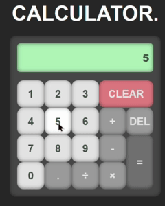

# 🧮 Calculator

This project is a simple calculator built as the final project of the **Foundations Course** from <a href = "https://www.theodinproject.com/" targer="_blank" rel="noopener noreferrer" >The Odin Project</a>  
It can perform basic arithmetic operations and accepts both button clicks and keyboard input.

---

## 🎨 Preview

---

## 🚀 Features
- Operates on numbers with a sign (positive/negative).
- Supports the basic arithmetic operators: `+`, `-`, `×`, `÷`.
- Handles floating point numbers using the `.` button.
- Accepts **keyboard input** for faster usage.
- `DEL` button deletes one number at a time.
- `CLEAR` button clears the entire input.

---

## ⌨️ Keyboard Shortcuts
- **Backspace** → acts as `DEL` (delete one element).  
- **Number keys (0–9)** → input numbers.  
- **Arithmetic keys (`+ - * /`)** → input operators.  
- **Enter / =** → evaluates the expression.  

---

## 📚 Learnings
- Initially, a **flag variable** was used to determine which number should be taken as input.  
  As the project grew, managing this flag became messy so I had to find a different approach. 
- Refactored the logic to depend on the **operator state**, which was much easier to track and extend.  
- This was my **first attempt at responsive design**. The calculator currently renders smaller than expected on some devices, but improving responsiveness will be a focus for future updates.  

---

## 👨‍💻 Author
Made by **Shaun** 😊 
